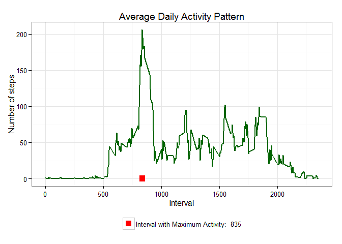

# Reproducible Research: Peer Assessment 1 - Manoj Kumar


```r
library(dplyr)
```

```
## 
## Attaching package: 'dplyr'
## 
## The following object is masked from 'package:stats':
## 
##     filter
## 
## The following objects are masked from 'package:base':
## 
##     intersect, setdiff, setequal, union
```

```r
library(ggplot2)
library(scales)

############ START OF QUESTION 1 ############

## Loading and preprocessing the data

## Q1. Show any code that is needed to :
##  1.  Load the data (i.e. read.csv())
##  2.  Process/transform the data (if necessary) into a format suitable for your analysis


my_data <- function() {
  
  # Store dataset file name in a vector
  projfile = "activity.zip"
  
  # Store location of the dataset file in a vector
  source_url = "https://github.com/profkumar/RepData_PeerAssessment1/blob/master/activity.zip"
  
  # If dataset is not already on the computer in the working deirectory, 
  # download it firstfrom the above location and store as vector as mentioned above  
  if(!file.exists(projfile)) {
    download.file(source_url, destfile = projfile, method="curl")
  }
  
  # Unzip the available (or downloaded) zipped dataset file and store into a vector
  fileunzip <- unz(projfile, "activity.csv")
  
  # Read unzipped csv file, define classes (according to assignment details) of column in it 
  # (so that there are no mistakes)
  myfile <- read.csv(fileunzip, header = TRUE, colClasses = c("numeric", "character", "numeric"))
  
  # convert "interval" column into factors
  myfile$interval <- factor(myfile$interval)
  
  # change the date format in "date" column (i.e. YYYY-MM-DD)
  myfile$date <- as.Date(myfile$date, format = "%Y-%m-%d")
  
  # Read data
  myfile
}

# store above data frame in "myfile" data frame 
myfile <- my_data()
myfile0 <- myfile

# Although not a part of this assignment, let us have a look into the data we have just prepared
head(myfile)
```

```
##   steps       date interval
## 1    NA 2012-10-01        0
## 2    NA 2012-10-01        5
## 3    NA 2012-10-01       10
## 4    NA 2012-10-01       15
## 5    NA 2012-10-01       20
## 6    NA 2012-10-01       25
```

```r
# Structure of the dataset
str(myfile)
```

```
## 'data.frame':	17568 obs. of  3 variables:
##  $ steps   : num  NA NA NA NA NA NA NA NA NA NA ...
##  $ date    : Date, format: "2012-10-01" "2012-10-01" ...
##  $ interval: Factor w/ 288 levels "0","5","10","15",..: 1 2 3 4 5 6 7 8 9 10 ...
```

```r
# Class of the dataset
class(myfile)
```

```
## [1] "data.frame"
```

```r
# Summarize the data
# and we see that there are 2304 NAs under variable name "steps", and assignment guidelines also talk about it.
summary(myfile)
```

```
##      steps             date               interval    
##  Min.   :  0.00   Min.   :2012-10-01   0      :   61  
##  1st Qu.:  0.00   1st Qu.:2012-10-16   5      :   61  
##  Median :  0.00   Median :2012-10-31   10     :   61  
##  Mean   : 37.38   Mean   :2012-10-31   15     :   61  
##  3rd Qu.: 12.00   3rd Qu.:2012-11-15   20     :   61  
##  Max.   :806.00   Max.   :2012-11-30   25     :   61  
##  NA's   :2304                          (Other):17202
```

```r
myNAfile <- myfile[!complete.cases(myfile), ]
paste("Total NAs under variable steps are : ", nrow(myNAfile), sep = " ")
```

```
## [1] "Total NAs under variable steps are :  2304"
```

```r
############ END OF QUESTION 1 ############
#
#
#
############ START OF QUESTION 2 ############

## Q2. What is mean total number of steps taken per day?
# Other question for which we have to provide solutions are:
#   1. Make a histogram of the total number of steps taken each day
#   2. Calculate and report the mean and median total number of steps taken per day

# Answers.... 

# Part 1: Plotting Histogram

cspd <- function(myfile) {
  spd <- aggregate(steps ~ date, myfile, sum)
  colnames(spd) <- c("date", "steps")
  spd
}

pspd <- function(spd, mns, mds) {
  clabs = c(paste("Mean:", formatC(mns, big.mark = ",", format = "f", digits = 0)), paste("Median:", formatC(mds, big.mark = ",", format = "f", digits = 0)))
  cols = c("red", "blue")
  
  ggplot(spd, aes(x = steps)) + 
    geom_histogram(fill = "lightgreen", binwidth = 1500, color = "black") + 
    geom_point(aes(x = mns, y = 0, color = "blue"), size = 4, shape = 15) + 
    geom_point(aes(x = mds, y = 0, color = "red"), size = 4, shape = 15) + 
    scale_color_manual(name = element_blank(), labels = clabs, values = cols) + 
    labs(title = "Histogram of Steps Taken per Day", x = "Number of Steps in a Day", y = "Frequency") + 
    theme_bw() + theme(legend.position = "bottom")    
}

spd <- cspd(myfile)
mns = round(mean(spd$steps), 2)
mds = round(median(spd$steps), 2)
pspd(spd, mns, mds)
```

 

```r
# Part 2: Reporting Mean
paste("Mean total number of steps taken per day: ", round(mns, 0), sep = " ")
```

```
## [1] "Mean total number of steps taken per day:  10766"
```

```r
# And Median
paste("Median total number of steps taken per day: ", round(mds, 0), sep = " ")
```

```
## [1] "Median total number of steps taken per day:  10765"
```

```r
############ END OF QUESTION 2 ############
#
#
#
############ START OF QUESTION 3 ############

## Q3. What is the average daily activity pattern?

# 1. Make a time series plot (i.e. type = "l") of the 5-minute interval (x-axis) and the average number of steps taken, averaged across all days (y-axis)
# 2. Which 5-minute interval, on average across all the days in the dataset, contains the maximum number of steps?

cspi <- function(myfile) {
    spi <- aggregate(myfile$steps, by = list(interval = myfile$interval),
                          FUN = mean, na.rm = TRUE)
    
    # convert to integers for plotting
    spi$interval <- as.integer(levels(spi$interval)[spi$interval])
    
    colnames(spi) <- c("interval", "steps")
    
    spi
}

pap <- function(spi, msi) {
    
  clabs = c(paste("Interval with Maximum Activity: ", msi))
    cols = c("red")

    ggplot(spi, aes(x = interval, y = steps)) +   
        geom_line(color = "darkgreen", size = 1) +  
        geom_point(aes(x = msi, y = 0, color = "red"), size = 4, shape = 15) +  
        scale_color_manual(name = element_blank(), labels = clabs, values = cols) +     
        labs(title = "Average Daily Activity Pattern", x = "Interval", y = "Number of steps") +  
        theme_bw() + theme(legend.position = "bottom")
}

spi <- cspi(myfile)

msi <- spi[which.max(spi$steps),]$interval

pap(spi, msi)
```

 

```r
paste("Interval with Maximum Activity : ", msi, sep = " ")
```

```
## [1] "Interval with Maximum Activity :  835"
```

```r
############ END OF QUESTION 3 ############
#
#
#
############ START OF QUESTION 4 ############

# Imputing missing values

# We earlier noted that there are many missing values (coded as NAs) in the dataset. 
# The presence of missing days may introduce bias into some calculations or summaries of the data

# Question 4: 
# Part 1:
# Calculate and report the total number of missing values in the dataset 
# (i.e. the total number of rows with NAs).

# Part 2:
# Devise a strategy for filling in all of the missing values in the dataset. 
# The strategy does not need to be sophisticated.
# For example, you could use the mean/median for that day, 
# or the mean for that 5-minute interval, etc.

# Part 3:
# Create a new dataset that is equal to the original dataset but 
# with the missing data filled in.

# Part 4:
# Make a histogram of the total number of steps taken each day and Calculate and report 
# the mean and median total number of steps taken per day. 
# Do these values differ from the estimates from the first part of the assignment? 
# What is the impact of imputing missing data on the estimates of the total daily number of 
# steps?


imeans <- function(myfile, defs) {
    nai <- which(is.na(myfile$steps))
    defs <- spi
    nar <- unlist(lapply(nai, FUN = function(idx){
        interval = myfile[idx, ]$interval
        defs[defs$interval == interval, ]$steps
        }))
    imps <- myfile$steps
    imps[nai] <- nar
    imps
}

comt <- data.frame(  
    steps = imeans(myfile, spi),  
    date = myfile$date,  
    interval = myfile$interval)


summary(comt)
```

```
##      steps             date               interval    
##  Min.   :  0.00   Min.   :2012-10-01   0      :   61  
##  1st Qu.:  0.00   1st Qu.:2012-10-16   5      :   61  
##  Median :  0.00   Median :2012-10-31   10     :   61  
##  Mean   : 37.38   Mean   :2012-10-31   15     :   61  
##  3rd Qu.: 27.00   3rd Qu.:2012-11-15   20     :   61  
##  Max.   :806.00   Max.   :2012-11-30   25     :   61  
##                                        (Other):17202
```

```r
ctspd <- cspd(comt)

cms = round(mean(ctspd$steps), 2)

cmds = round(median(ctspd$steps), 2)

pspd(ctspd, cms, cmds)
```

 

```r
############ END OF QUESTION 4 ############
#
#
#
############ START OF QUESTION 5 ############
# Are there differences in activity patterns between weekdays and weekends?

# First replace the missing values in the table.
# Then we augment the table with a column that indicates the day of the week
# Followed by subsetting the table into two parts - 
  # weekends (Saturday and Sunday); and 
  # weekdays (Monday through Friday)
# We then tabulate the average steps per interval for each dataset.
# And plot the two datasets side by side for comparison.

cdwd <- function(myfile) {
    myfile$weekday <- as.factor(weekdays(myfile$date))
    
    # Subset of weekend days
    wed <- subset(myfile, weekday %in% c("Saturday", "Sunday"))

    # Subset of week days
    wkd <- subset(myfile, !weekday %in% c("Saturday", "Sunday"))

    wspi <- cspi(wed)
    wdspi <- cspi(wkd)

    wspi$dow <- rep("Weekend Days", nrow(wspi))
    wdspi$dow <- rep("Week Days", nrow(wdspi))

    dwd <- rbind(wspi, wdspi)
    dwd$dow <- as.factor(dwd$dow)
    dwd
}

pdwc <- function(dowd) {
    ggplot(dowd, 
        aes(x = interval, y = steps)) + 
        geom_line(color = "red", size = 1) + 
        facet_wrap(~ dow, nrow = 2, ncol = 1) +
        labs(x = "Interval", y = "Number of Steps Per Interval") +
        theme_bw()
}

dofwd <- cdwd(comt)
pdwc(dofwd)
```

 

```r
# As compare to weekends, the activity on the week days are widely spread. 

# The obvious reason for that is on weekdays there are much more routine movements (due to work etc.) while most people take rest / stay at home on weekends.


############ END OF QUESTION 5 ############

###  This concluded the assignment as well ###


#
```
